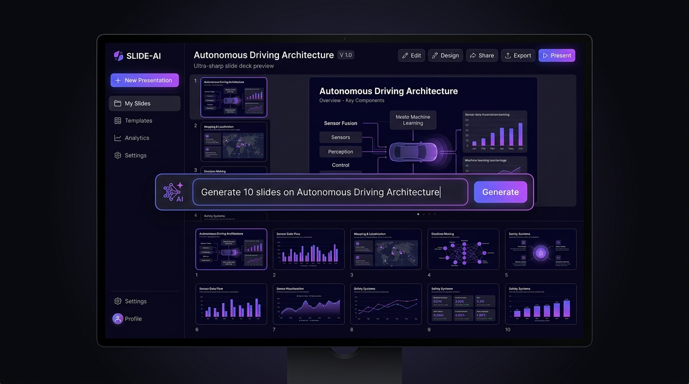
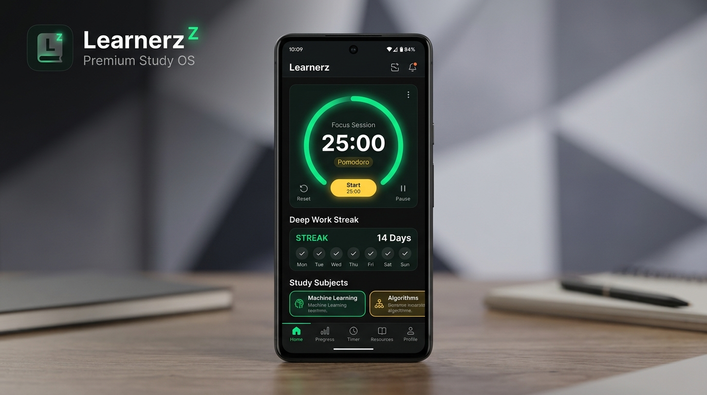

<div align="center">

  <h1>Aaditya Pawar</h1>
  <p><strong>Computer Engineering Student • Full-Stack & AI Systems • High-Performance 3D WebGL</strong></p>

  <!-- Dynamic Typing Subtitle -->
  <a href="https://github.com/Adityapawar7">
    
  </a>

  <br/><br/>

  <!-- Quick Navigation -->
  <p align="center">
    <a href="#-about-me"><b>About</b></a> •
    <a href="#%EF%B8%8F-core-engineering-stack"><b>Stack</b></a> •
    <a href="#-featured-projects--repositories"><b>Projects</b></a> •
    <a href="#-github-telemetry"><b>Telemetry</b></a> •
    <a href="#-unattended-daily-repository-digest"><b>Daily Digest</b></a> •
    <a href="#-connect--collaborate"><b>Contact</b></a>
  </p>

  <!-- Social & Connect Badges -->
  <p align="center">
    <a href="mailto:adityapawarone8@gmail.com">
      
    </a>
    <a href="https://github.com/Adityapawar7">
      
    </a>
    <a href="https://scuderia-ferrari-webgl.vercel.app" target="_blank">
      
    </a>
    
  </p>

</div>

---

### 👋 About Me

> Passionate **Computer Engineering student** with practical expertise in **Artificial Intelligence, Machine Learning, Full-Stack Architecture**, and **Zero-Lag 3D Graphics**. Focused on engineering robust digital systems — ranging from intelligent AI presentation engines and Android productivity platforms to real-time 60+ FPS WebGL simulations.

```javascript
const engineer = {
  name: "Aaditya Pawar",
  role: "Computer Engineering Student & Full-Stack / AI Systems Developer",
  disciplines: [
    "Artificial Intelligence & Machine Learning (Python)",
    "Full-Stack Web Architectures (React, Next.js, TypeScript)",
    "High-Performance 3D WebGL & Shaders (Three.js, R3F)",
    "Mobile & Native Engineering (Android / Kotlin)"
  ],
  engineeringStandard: "60–120 FPS performance, clean architecture, automated resilience.",
  location: "India"
};
```

---

### 🛠️ Core Engineering Stack

<div align="center">
  
</div>

<br/>

| Engineering Layer | Technologies & Tools |
| :--- | :--- |
| **Languages** | **Python**, **TypeScript**, **JavaScript**, **Kotlin**, **HTML5/CSS3**, **SQL** |
| **AI, ML & Data** | **Python (NumPy, Pandas, Scikit-Learn)**, Prompt Engineering, Generative AI Workflows |
| **Frontend & 3D Web** | **React 19**, **Next.js**, **Three.js**, **React Three Fiber**, **GSAP**, **Tailwind CSS**, **Lenis** |
| **Mobile & Systems** | **Android SDK**, **Kotlin**, **System Automation & Developer OS Tooling** |
| **DevOps & Cloud** | **GitHub Actions (Unattended CI/CD)**, **Git**, **Vite**, **Vercel**, **gltf-transform** |

---

### 📂 Featured Projects & Repositories

A curated portfolio of active public repositories across AI systems, creative 3D graphics, mobile OS, and developer tooling:

<table>
  <tr>
    <td width="55%">
      <h3>🤖 SLIDE-AI-</h3>
      <p>An AI-powered presentation platform that instantly transforms text prompts into multi-slide presentations with automated layouts, speaker scripts, and PPTX export.</p>
      <ul>
        <li>⚡ <strong>Automated Generation</strong> — Intelligent slide deck generation from natural language prompts</li>
        <li>📑 <strong>Multi-Format Export</strong> — Generates editable PPTX presentations and presentation outlines</li>
        <li>🎨 <strong>Modular Frontend</strong> — Built with TypeScript and modern presentation layouts</li>
      </ul>
      <p>
        <a href="https://github.com/Adityapawar7/SLIDE-AI-"><strong>View Repository »</strong></a>
      </p>
    </td>
    <td width="45%" align="center">
      <a href="https://github.com/Adityapawar7/SLIDE-AI-">
        
      </a>
    </td>
  </tr>
  <tr>
    <td width="55%">
      <h3>🏁 Scuderia Ferrari 488 GT3 — 3D WebGL Showcase</h3>
      <p>An Awwwards-tier interactive 3D WebGL experience built with <strong>Three.js</strong>, <strong>React Three Fiber</strong>, and <strong>GSAP</strong>.</p>
      <ul>
        <li>⚡ <strong>Zero-Lag Kinetic Physics</strong> — Rock-solid 60+ FPS with Draco-compressed 3D geometry</li>
        <li>🎯 <strong>Custom Telemetry Cursor</strong> — 0ms hardware pointer tracking with aerodynamic velocity stretch</li>
        <li>🏎️ <strong>Interactive Stages</strong> — Ground-effect telemetry, aerodynamics inspection, and live finale</li>
      </ul>
      <p>
        <a href="https://github.com/Adityapawar7/scuderia-ferrari-webgl"><strong>View Repository »</strong></a> • 
        <a href="https://scuderia-ferrari-webgl.vercel.app" target="_blank"><strong>Live Demo »</strong></a>
      </p>
    </td>
    <td width="45%" align="center">
      <a href="https://github.com/Adityapawar7/scuderia-ferrari-webgl">
        
      </a>
    </td>
  </tr>
  <tr>
    <td width="55%">
      <h3>📱 Learnerz — Premium Study OS & Focus Suite</h3>
      <p>A native Android deep-work productivity suite engineered with <strong>Kotlin</strong> and Android SDK for distraction-free study blocks and cognitive retention.</p>
      <ul>
        <li>⏱️ <strong>Focus Session Engine</strong> — Custom timer algorithms and structured Pomodoro work states</li>
        <li>🎯 <strong>Habit Tracking & Analytics</strong> — Local SQLite session storage and productivity metrics</li>
      </ul>
      <p>
        <a href="https://github.com/Adityapawar7/learnerz-premium-study-suite"><strong>View Repository »</strong></a>
      </p>
    </td>
    <td width="45%" align="center">
      <a href="https://github.com/Adityapawar7/learnerz-premium-study-suite">
        
      </a>
    </td>
  </tr>
  <tr>
    <td width="55%">
      <h3>⚙️ DeveloperOS</h3>
      <p>A modular system automation and developer utility suite written in <strong>Python</strong> to streamline development environments, automate recurring tasks, and enhance desktop workflow productivity.</p>
      <ul>
        <li>🛠️ <strong>Task Automation</strong> — Automated development setup scripts and system tooling</li>
        <li>💻 <strong>Cross-Platform Scripts</strong> — Modular Python automation pipelines</li>
      </ul>
      <p>
        <a href="https://github.com/Adityapawar7/DeveloperOS"><strong>View Repository »</strong></a>
      </p>
    </td>
    <td width="45%" align="center">
      <a href="https://github.com/Adityapawar7/DeveloperOS">
        
      </a>
    </td>
  </tr>
</table>

<details>
<summary><b>🔍 View Additional Experiments & Repositories</b></summary>
<br/>

| Repository | Domain | Tech Stack | Overview |
| :--- | :--- | :---: | :--- |
| **[primeparkour](https://github.com/Adityapawar7/primeparkour)** | 3D Physics | `TypeScript` | Interactive 3D parkour physics engine and browser kinematics simulation. |
| **[3dportfolio](https://github.com/Adityapawar7/3dportfolio)** | Creative Web | `TypeScript` | Spatial 3D portfolio environment showcasing interactive digital projects. |
| **[portfoli](https://github.com/Adityapawar7/portfoli)** | Web Engineering | `TypeScript` | Software engineering portfolio index and personal project directory. |

</details>

---

### 📡 Unattended Daily Repository Digest

<!--DIGEST_START-->

### 📡 Live Repository Telemetry & Activity Digest
> *Automated digest compiled at **`2026-09-09 08:21 UTC`** by unattended GitHub Actions runner.*

| Repository | Focus & Domain | Primary Tech | Stars | Forks | Open Issues | Last Activity |
| :--- | :--- | :---: | :---: | :---: | :---: | :---: |
| [`scuderia-ferrari-webgl`](https://github.com/Adityapawar7/scuderia-ferrari-webgl) | An immersive, interactive 3D WebGL showcase of the Ferrari 488 GT3 built with... | `TypeScript` | ⭐ 2 | 🍴 0 | ⚠️ 0 | 🕒 `2026-09-06` |
| [`SLIDE-AI-`](https://github.com/Adityapawar7/SLIDE-AI-) | 🚀 An AI-powered presentation platform that instantly transforms text prompts ... | `TypeScript` | ⭐ 1 | 🍴 0 | ⚠️ 0 | 🕒 `2026-06-21` |
| [`learnerz-premium-study-suite`](https://github.com/Adityapawar7/learnerz-premium-study-suite) | ⏳ Learnerz — Premium Study OS & Focus Suite for Android Achieve Ultra-Deep Wo... | `Kotlin` | ⭐ 1 | 🍴 0 | ⚠️ 0 | 🕒 `2026-07-26` |
| [`DeveloperOS`](https://github.com/Adityapawar7/DeveloperOS) | Developer Productivity & Operating System Utility Ecosystem | `Python` | ⭐ 1 | 🍴 0 | ⚠️ 1 | 🕒 `2026-08-09` |

<!--DIGEST_END-->

---

### 📊 GitHub Telemetry & Momentum

<div align="center">
  <!-- Streak Counter -->
  
</div>

<br/>

#### 🐍 Live Contribution Activity

<picture>
  <source media="(prefers-color-scheme: dark)" srcset="https://raw.githubusercontent.com/Adityapawar7/Adityapawar7/output/github-contribution-grid-snake-dark.svg">
  <source media="(prefers-color-scheme: light)" srcset="https://raw.githubusercontent.com/Adityapawar7/Adityapawar7/output/github-contribution-grid-snake.svg">
  
</picture>

---

<div align="center">

### 🤝 Connect & Collaborate

Open for engineering opportunities, collaborative AI development, scalable software systems, and innovative WebGL products.

<a href="mailto:adityapawarone8@gmail.com">
  
</a>

</div>
